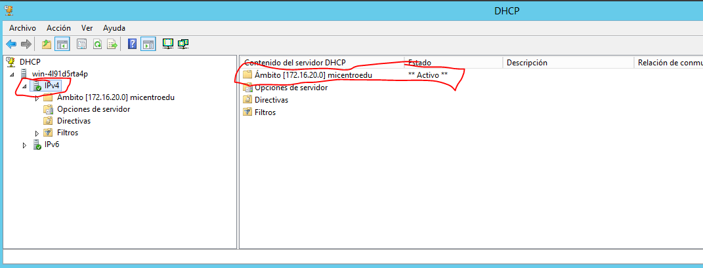
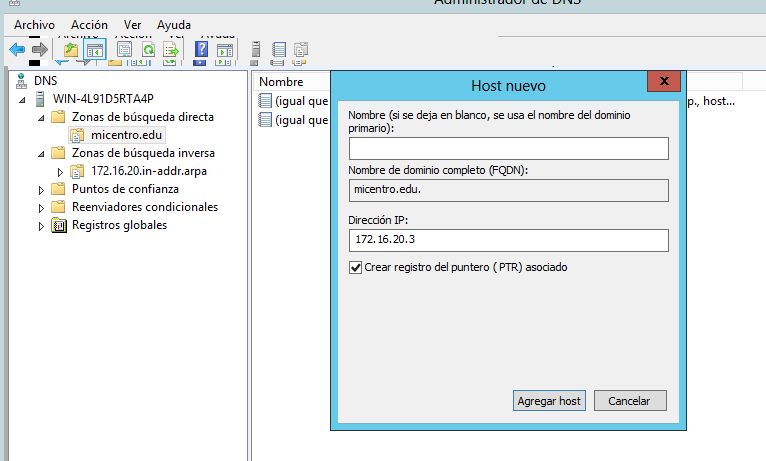
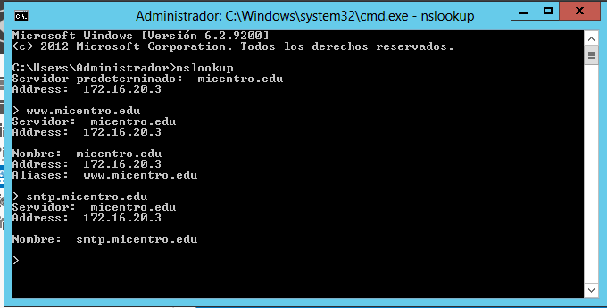
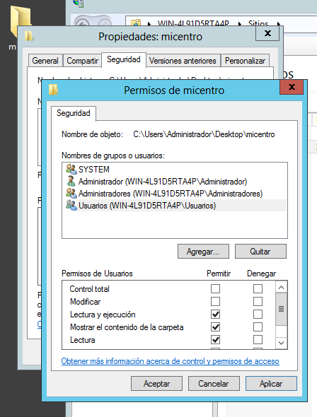
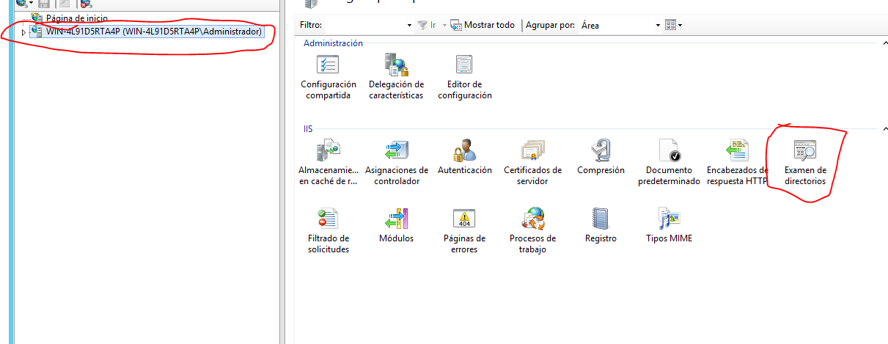
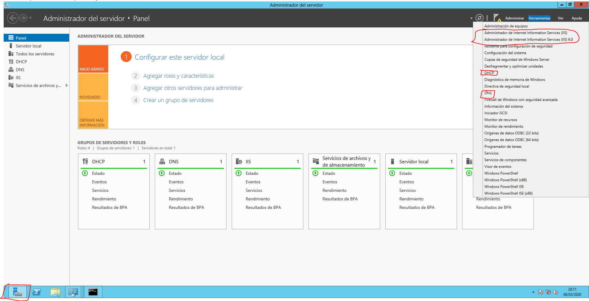

# IIS-DNS-DHCP-Windows-Config
> El servidor estará bajo una maquina virtual en VBox, la red va ser interna y todo va ser localmente.

## Indice
- [IIS-DNS-DHCP-Windows-Config](#iis-dns-dhcp-windows-config)
  - [Indice](#indice)
    - [Configuracion del servidor](#configuracion-del-servidor)
    - [Configuración del servidor DHCP](#configuraci%c3%b3n-del-servidor-dhcp)
    - [Configuración del servidor DNS](#configuraci%c3%b3n-del-servidor-dns)
    - [Configuracion del servidor IIS](#configuracion-del-servidor-iis)
      - [Posibles errores y soluciones](#posibles-errores-y-soluciones)
    - [Como acceder a la configuracion de los diferentes servicios](#como-acceder-a-la-configuracion-de-los-diferentes-servicios)

### Configuracion del servidor

- **Direccion IP:** 172.16.20.3.
- **Mascara:** 255.255.255.0.
- **Puerta de enlace:** 127.16.20.1.
- **Nombre del dominio:** micentro.edu.

Lo primero antes de empezar a configurar los servicios de DNS, DHCP y demás es configurar la tarjeta de red y la direccion ip:

Con esto configurado vamos a pasar a la configuracion del servidor **DHCP** por si tenemos que probar con un cliente.

> Para agregar cualquier servicio o caracteristica en Windows server hay que meterse en la **Administrador del servidor** y dentro arriba a la derecha en **Administrar** se abrirá un desplegable donde saldrá en la primera opción **Agregar roles y características**, despues de seguir esto se abrirá un asistente demasiado simple como para explicarlo, sencillamente siguiente seleccionas los servicios y se instalana.

Una vez agregador todos los servicios(DHCP,DNS,IIS,SMTP y cliente Telnet), vamos a configurarlos uno a uno:

### Configuración del servidor DHCP

Si no sabes encontrar la configuracion del servidor haz clic [aqui](#como-acceder-a-la-configuracion-de-los-diferentes-servicios)

Configuración del servidor DHCP:

- **Nobre del ámbito:** micentroedu.
- **Direccion IP Inicial:** 172.16.20.5
- **Direccion ip Final:** 172.16.20.15
- **Longitud de la mascara:** 24(255.255.255.0)
> A partir de aquí las siguientes opciones estarán por defecto, y las opciones que estan configuradas por defecto, las opciones que estan justo debajo es uno de los pasos del asistente, que tendremos que elegir **Configurar estas opciones ahora**
- **Direccion ip del enrutador(Puerta de enlace predeterminada):** 172.16.20.1
- **Dominio primario:** micentro.edu
  > Este ultimo apartado deberia estar relleno por defecto si no es asi se cogeria la direccion ip del servidor, en este caso la **172.16.20.3**
- **Direcciones IP y nombre del servidor**

> Saltara otra pantalla de configuración de **WINS**, la dejamos por defecto y siguiente, **Activar este ámbito ahora** y listo. Ya solo faltaria comprobar que está activado.

### Configuración del servidor DNS

Si no sabes encontrar la configuracion del servidor haz clic [aqui](#como-acceder-a-la-configuracion-de-los-diferentes-servicios)

Yo la configuracion del servidor DNS la voy a empezar al reves, es decir, voy a hacer la configuracion de la zona inversa, y luego la de la zona directa, porque sino tengo que despues crear a mano los **Punteros PTR** en la zona inversa y asi me ahorro trabajo y tiempo.

Para configurar la zona inversa del servidor DNS:
- Entrar en la configuracion del servidor DNS, una vez dentro saldrá a la izquierda un arbol con carpetas, clic derecho en la carpeta que dice **Zona de búsqueda inversa**, las configuraciones las voy a dejar por apartados:

    - **Tipo de zona:** Zona principal
    - **Nombre de la zona de búsqueda inversa:** Zona de búsqueda inversa para IPv4.
    - **Id. de red:** son las tres primeras partes de la direccion ip del servidor, es decir: 172.16.20.3 = 172.16.20
    - **Archivo de zona:** Crear un archivo un archivo nuevo con este nombre de archivo.

> Las siguientes opciones son siguiente, siguiente.

Configuracion de la zona directa del servidor DNS:

Justo encima de la carpeta de **Zonas de búsqueda inversa** sale: **Zonas de búsqueda directa**: clic derecho y **Zona nueva...**
- **Tipo de zona:** Zona principal
- **Nombre de zona:** micentro.edu
- **Archivo de zona:** Crear un archivo nuevo con este nombre de archivo:
  
> Siguiente y siguiente

Ahora accedemos a la carpeta que se habrá creado dentro de la **Zona de búsqueda directa**, y nos saldrán dos archivos uno de tipo **SOA** y otro de tipo **NS**. Justo debajo damos clic derecho y en el desplegable le damos a **Host nuevo(A o AAAA)...**

- **Nombre:** se deja en blanco
- **Nombre de dominio completo(FQDN):** se deja tal cual.
- **Direccion IP:** la del servidor, es decir: 172.16.20.3
- **Marcar el Crear registro del puntero(PTR) asociado.**

Despues de configurar el host con la direccion ip del servidor, vamos a configurar el alias de tipo **CNAME**, para el servidor **IIS** y el de tipo **MX** para le servidor **SMTP**

**Alias nuevo(CNAME)**:

- **Nombre de alias:** www
- **Nombre de dominio completo(FQDN):** le damos a acceder y vamos accediendo por las carpetas hasta entrar en micentro.edu donde nos saldrá la direccion ip del servidor, seleccionamos el archivo y le damos a aceptar.

Para el registro de tipo **MX**, hay que hacer practicamente que con el de tipo **CNAME**, solo que aqui en Host o dominio secundario hay que poner smtp y lo demás dejarlo por defecto:

> Para comprobar que ha funcionado abrimos un **CMD** y poner nslookup y nos saldran nuestros datos, despues ponemos los siguientes nombre de dominio y nos deberia de responder correctamente: www.micentro.edu, smtp.micentro.edu

### Configuracion del servidor IIS
Si no sabes encontrar la configuracion del servidor haz clic [aqui](#como-acceder-a-la-configuracion-de-los-diferentes-servicios)

IIS cuando accedemos a su configuracion a la izquierda en la vista de arbol, tenemos una capeta llamadas **Sitios** y **Grupos de aplicaciones**. En **Sitios** se guardan las paginas web.

Para configurar nuestra pagina web en IIS, le damos clic derecho en sitios y **Agregar sitio web...**.

- **Nombre del sitio:** el que querais **Pagina del centro** por ejemplo
- **Ruta de acceso fisica:** añadimos una ruta hacia una carpeta donde se guardaran los html, y subcarpetas de la pagina web, yo pondré una carpeta en el **Escritorio** mismo
- **Tipo de enlace** http.
- **Direccion IP:** la del servidor: 172.16.20.3.
- **Puerto:** 80.
- **Nombre del host:** el nombre del servidor DNS con su registro de tipo CNAME www.micentro.edu

Al terminar este paso hay que asignarle permisos a la carpeta creada en el **Escritorio** en Windows, clic derecho **Propiedades**, dentro de Propiedades en la pestaña **Seguridad**. Le damos a **Editar...** y **Agregar...**, escribimos usuarios tal cual y le damos al enter, nos saldrá una ventana agregamos los Usuarios y cerramos.

> Ya solo faltaria mirar en el navegador en la direccion **www.micentro.edu** si muestra la pagina, en la carpeta creada habria que añadir un **index.html** para que se vea algo sino saldra **www.micentro.edu/**

#### Posibles errores y soluciones
- **Error 403.14:** Prohibido el acceso
  - Solucion: En la configuracion del IIS le damos clic al **nombre del servidor** y luego en **examen de directorios**, dentro le damos a **habilitar.** Con esto el problema estaria solucionado.
  

### Como acceder a la configuracion de los diferentes servicios

Para acceder a la configuracion de los diferentes servicios en **Windows 2012 Server** tienes que irte al administrador del servidor, una vez dentro arriba a la derecha te sale una opcion que se llama **Herramientas** que al hacerle clic te abre un desplegable, en ese desplegable buscas el servicio y se te abrirá la configuracion del mismo.

[Volver al indice](#indice)
